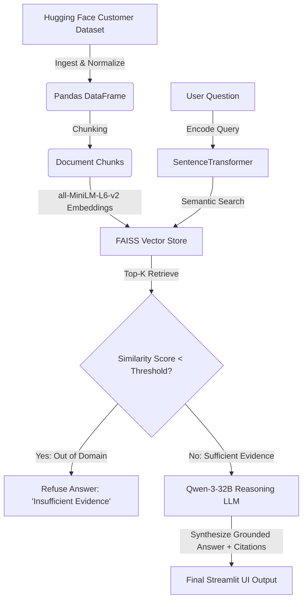

# 🎫 Support Ticket RAG Evaluator

[](https://www.python.org/)
[](https://streamlit.io/)
[](https://github.com/facebookresearch/faiss)
[](https://groq.com/)
[](https://opensource.org/licenses/MIT)

An enterprise-ready **Retrieval-Augmented Generation (RAG)** system designed to resolve customer support tickets. Traditional chatbots often hallucinate, which is unacceptable in customer-facing support roles. This application enforces strict **grounding, citation tracking, and confidence-based refusal** to ensure every answer is backed by actual ticket history. It also features a fully interactive **Evaluation Dashboard** tracking RAG retrieval accuracy and response latency.

---

## 📖 Table of Contents
* [System Architecture](#-system-architecture)
* [Key Features](#-key-features)
* [Tech Stack](#%EF%B8%8F-tech-stack)
* [Local Setup & Testing](#-local-setup--testing)
* [Running the Evaluation Suite](#-running-the-evaluation-suite)
* [Verification Guide](#-verification-guide-is-it-working)
* [Streamlit Cloud Deployment](#%EF%B8%8F-streamlit-cloud-deployment)
* [Limitations & Future Enhancements](#-limitations--future-enhancements)

---

## 🏗️ System Architecture



1. **Ingestion & Normalization:** Standardizes raw tickets into columns (`ticket_id`, `customer_issue`, `category`, `resolution`, `source_text`).
2. **Chunking & Vectorization:** Text is processed and encoded into dense vectors using `sentence-transformers` and stored in a local **FAISS** index.
3. **Retrieval Guardrail:** Calculates the semantic distance of the top matches. If the nearest ticket exceeds the distance threshold (weak evidence), the system triggers a **graceful refusal** to prevent hallucination.
4. **Reasoning Synthesis:** The retrieved context is passed to **Qwen-3-32B** to formulate a response containing strict citations of the ticket IDs used.

---

## 🌟 Key Features

* **Grounding Guardrails:** Uses distance thresholds from FAISS search results to filter out unrelated user queries.
* **Traceable Citations:** Generates answers only from the retrieved support tickets, citing the specific source ticket IDs (e.g., `(Citation: TICKET_0123)`).
* **Interactive UI Tabs:**
  * **Ask:** A user-friendly chat interface for submitting customer service questions.
  * **Evidence:** Expands and displays the raw retrieved context with similarity scores.
  * **Evaluation:** Displays real-time test suite metrics (Hit@3, Hit@5, latency, refusal accuracy) from validation runs.
  * **Dataset:** Interactive Plotly distribution of the support ticket categories and raw samples.

---

## 🛠️ Tech Stack

* **Language:** Python 3.10+
* **Vector Store:** FAISS (Facebook AI Similarity Search)
* **Embedding Model:** `sentence-transformers/all-MiniLM-L6-v2`
* **LLM Engine:** Groq API / OpenRouter (`qwen/qwen3-32b`)
* **Framework:** Streamlit (v1.30+)
* **Data Processing & Viz:** Pandas, NumPy, Plotly

---

## 💻 Local Setup & Testing

### 1. Prerequisites
Ensure you have Python 3.10+ installed.

### 2. Clone the Repository & Install Dependencies
```bash
git clone https://github.com/HariHaran9597/Support-Ticket-RAG.git
cd Support-Ticket-RAG
python -m venv venv
```

Activate the virtual environment:
* **Windows:**
  ```powershell
  venv\Scripts\activate
  ```
* **macOS/Linux:**
  ```bash
  source venv/bin/activate
  ```

Install requirements:
```bash
pip install -r requirements.txt
```

### 3. Configure Environment Variables
Create a `.env` file in the root directory:
```env
GROQ_API_KEY="your_groq_api_key_here"
```

### 4. Run the Data Pipeline
Build the knowledge base sequentially (processes dataset, generates embeddings, and indexes them in FAISS):
```bash
python src/ingest.py
python src/chunking.py
python src/embeddings.py
python src/vectorstore.py
```

### 5. Generate Test Set & Evaluate
Run the offline evaluation suite to calculate baseline performance metrics:
```bash
python src/generate_eval_set.py
python src/evaluation.py
```

### 6. Run the Web Application
```bash
streamlit run app.py
```

---

## 📊 Running the Evaluation Suite

The system is evaluated using a validation set of **28 questions** (25 real-world historical tickets and 3 out-of-domain baseline questions).

### Current Benchmark Results (`qwen/qwen3-32b`)

| Metric | Target | Actual Score | Description |
| :--- | :--- | :--- | :--- |
| **Hit@3** | > 70% | **71.0%** | Target ticket is in the top 3 retrieved results |
| **Hit@5** | > 80% | **86.0%** | Target ticket is in the top 5 retrieved results |
| **Avg Top Similarity** | — | **0.60** | Average distance score of the closest matching ticket |
| **Refusal Accuracy** | 100% | **100.0%** | Successfully blocked unrelated queries (e.g. baking recipes) |
| **Avg LLM Latency** | < 8.0s | **5.99s** | Average round-trip time for a reasoning model response |

---

## 🔍 Verification Guide (Is it working?)

To verify your system is working correctly, test it with these two types of queries in the **Ask** tab:

### Test Case A: Valid In-Domain Query
* **Input Query:** `"I need assistance to enter another shipping address"`
* **Expected Output:** 
  1. The status indicator should show `answered`.
  2. The generated output must provide clear, numbered steps.
  3. A clear citation should be printed, e.g., `(Citation: TICKET_0740)`.
  4. The **Evidence** tab should display the matching tickets with a similarity distance below `1.5` (lower is closer).

### Test Case B: Out-of-Domain Query (Refusal Guardrail)
* **Input Query:** `"What is the recipe for chocolate cake?"`
* **Expected Output:**
  1. The status indicator should show `refused`.
  2. The warning block should state: `"I don't have enough evidence in the ticket database to answer this question."`
  3. The **Evidence** tab should show that the closest ticket had a similarity score larger than the threshold (`> 1.5`), showing that the guardrail successfully caught it.

---

## ☁️ Streamlit Cloud Deployment

Streamlit Cloud is the easiest way to deploy this application for free.

### Step-by-Step Instructions:

1. **Commit your Local Data and Index (Optional):**
   The `.gitignore` ignores the FAISS files by default to keep the repo clean. However, for Streamlit Cloud to run without running the ingestion pipeline on the server, you should push the generated index and parquet files. 
   
   To do this, temporarily modify your `.gitignore` to comment out `artifacts/` or run:
   ```bash
   git add artifacts/faiss.index artifacts/metadata.parquet eval/results.csv
   git commit -m "Add index artifacts for deployment"
   git push origin main
   ```

2. **Deploy via Streamlit Share:**
   * Go to [share.streamlit.io](https://share.streamlit.io/) and log in with your GitHub account.
   * Click **New app**.
   * Select your Repository: `HariHaran9597/Support-Ticket-RAG`.
   * Select the Branch: `main`.
   * Select the Main file path: `app.py`.

3. **Configure Secrets (Crucial):**
   * Before clicking **Deploy**, click the **Advanced settings** gear icon.
   * In the **Secrets** text area, add your Groq API Key:
     ```toml
     GROQ_API_KEY = "gsk_your_actual_key..."
     ```
   * Click **Save**.

4. **Launch:**
   * Click **Deploy!** Your app will build, spin up the dependencies, and be live at a public URL in a few minutes.

---

## ⚠️ Limitations & Future Enhancements

* **In-Memory Store:** The current v1 local FAISS vector store loads the database into memory. For larger scale datasets (>100k tickets), this should be migrated to a dedicated vector database (e.g., Pinecone, Qdrant).
* **Chunking Strategy:** Uses a single chunk per ticket. If tickets grow to have very long chat threads, a recursive or sliding-window chunking strategy will be necessary to preserve context window space.
* **Hybrid Search:** Adding BM25 keyword matching alongside dense embeddings would improve retrieval of specific SKU codes, order numbers, and exact technical terms.
